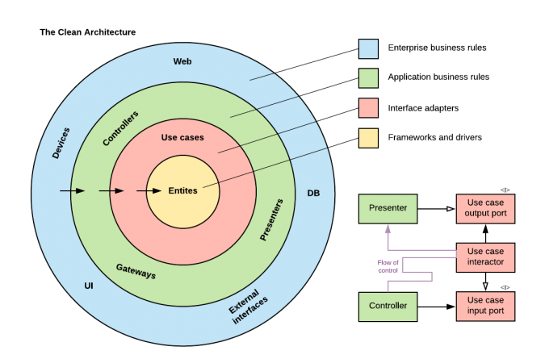

# [Architecture](README.md)

## Clean Architecture

Clean Architecture, introduced by Robert C. Martin (also known as Uncle Bob), is a software design philosophy that aims to create systems that are easy to maintain, test, and understand. It emphasizes separation of concerns and defines clear boundaries between different layers of your application. The core idea is to create a flexible architecture that is not dependent on frameworks, UI, databases, or any external agency.

## Principes

* Separation of Concerns: Different parts of the codebase have distinct responsibilities, and these responsibilities should be isolated from one another. This isolation allows the system to be flexible and adaptable to changes.

* Dependency Rule: The core of the application should never depend on the outer layers. The flow of dependencies always points inward, and the inner layers are unaware of the existence of the outer layers. This makes the system independent of frameworks and easily testable.

* Entities: The innermost layer contains the core business logic. These are simple objects or data structures that represent the most general business rules and are independent of any framework or database.

* Use Cases: This layer defines the application-specific business rules. It contains the use cases of the application, orchestrating the flow of data to and from the entities.

* Interface Adapters: This layer is responsible for converting data between the use case and entities and the external agents, like databases, frameworks, or UI components. Examples include controllers, presenters, and gateways.

* Frameworks & Drivers: The outermost layer includes external libraries, frameworks, and databases. This layer is responsible for handling infrastructure concerns like sending HTTP requests, persisting data, or interacting with third-party services.

## Goals
* Framework Independence: Your business logic does not depend on any specific framework, making it easier to switch frameworks if needed.
* UI Independence: The UI can be changed without affecting the core business logic.
* Testability: With a clean separation of concerns, individual parts of the application can be tested independently.
* Maintainability: Code is easier to maintain and extend as changes in one layer have minimal impact on others.

### When to apply
* Complex Business Logic: If your application has or is expected to have complicated business rules, Clean Architecture can help keep this logic manageable.
* Long-Term Projects: For projects that will be maintained and extended over many years, having a clean separation of concerns makes future work easier.
* Need for Flexibility: When you expect that you may need to switch technologies, frameworks, or data storage solutions in the future, Clean Architecture provides a structure that makes such changes easier.
* Test-Driven Development: If your team heavily relies on automated testing, this architecture supports unit testing by decoupling the business logic from infrastructure concerns.
* Large Development Teams: If multiple teams work on different parts of the system, having clear boundaries between layers helps organize work efficiently.

### How to implement
* Plan the Layers and Boundaries
* Create Your Business Models
* Define Use Cases (Application Logic)
* Create Interface Adapters (Controllers, Presenters, Gateways)
* Implement Repositories (Data Access Layer)
* Use DI for Flexibility

## Summary
Clean Architecture encourages creating an application independent of frameworks, easy to maintain, and flexible to change. By clearly defining boundaries between different layers and ensuring dependencies flow inward, you make your application robust and adaptable to changes in requirements or technology.
