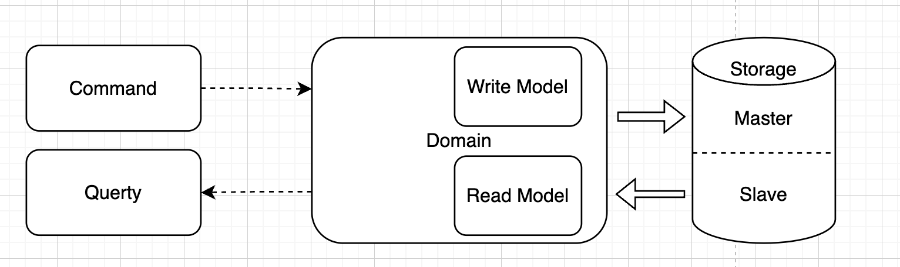
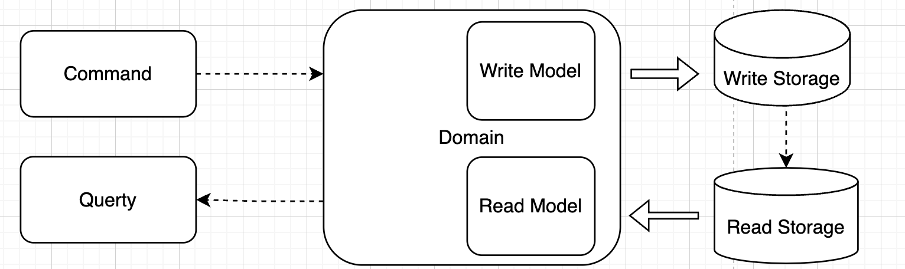
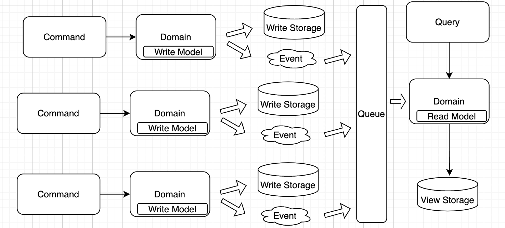

# [Architecture](README.md)

## CQRS
CQRS takes the defining principle of [CQS](cqs.md).
CQRS stands for Command and Query Responsibility Segregation, a pattern that separates read and write operations for a data store.
In traditional architectures, the same data model is used to query and update a database. 
That's simple and works well for basic CRUD operations. In more complex applications, however, this approach can become unwieldy. 
For example, on the read side, the application may perform many different queries, returning data transfer objects (DTOs) with different shapes.
Object mapping can become complicated. On the write side, the model may implement complex validation and business logic. 
As a result, you can end up with an overly complex model that does too much.

[Master-slave](https://www.linkedin.com/pulse/master-slave-database-architecture-kartik-madnani) is a way to optimize the I/O in your application other than using caching.

A more advanced version has a separation of writing and reading to different databases.

On microservice level use [database per service pattern](https://microservices.io/patterns/data/database-per-service.html) for write and define a view database for read, which is a read-only replica that is designed to support that query.

### [CQR or CQRS](cqs_cqrs.md)

### When to apply
* In event sourcing, when you have a complex or hard business domain
* In large team - You can split development tasks between people easily if you have chosen CQRS architecture
* When we have difficult business logic - CQRS forces you to avoid mixing domain logic and infrastructural operations
* Collaborative domains where many users access the same data in parallel
* Querying between microservices. It help to avoid complex queries to get rid of inefficient joins
* Scenarios where performance of data reads must be fine-tuned separately from performance of data writes
* Scenarios where one team of developers can focus on the complex domain model that is part of the write model, and another team can focus on the read model and the user interfaces
* Integration with other systems, especially in combination with event sourcing, where the temporal failure of one subsystem shouldn't affect the availability of the others

### Summary 
* CQRS is not a pattern that encompasses the whole application. It is a concept that builds on Domain Driven Design [DDD](https://learn.microsoft.com/ru-ru/dotnet/architecture/microservices/microservice-ddd-cqrs-patterns/apply-simplified-microservice-cqrs-ddd-patterns).
* CQRS provides us a convenient way to select separate domain models appropriate for write and read operations; we don't have to create a complex domain model supporting both
* It helps us to select repositories that are individually suited for handling the complexities of the read and write operations, like high throughput for writing and low latency for reading
* The complex business logic goes into the write model. The read model can be simple
* Low Technical Debt and High Maintainability. Adding features should not require large code-base changes
* It's easier to ensure that only the right domain entities are performing writes
* It allows the read and write models to scale independently
* CQRS extends this concept into a higher level for machine-machine APIs, separation of the message models and processing paths

#### CQRS in PHONE
* Commands: Microphone for speak
* Queries: Speaker to listen

#### CQRS in DB
* Commands: Master for write
* Queries: slave for read

#### CQRS in CODE
* Commands: One model for write
* Queries: One model for read

### Read
* [Martin Fowler - CQRS](https://martinfowler.com/bliki/CQRS.html)
* [Microsoft - CQRS](https://learn.microsoft.com/en-us/azure/architecture/patterns/cqrs)
* [CQRS – Simple architecture](https://kariera.future-processing.pl/blog/cqrs-simple-architecture/)
* [CQRS Design Pattern in Microservices Architectures](https://medium.com/design-microservices-architecture-with-patterns/cqrs-design-pattern-in-microservices-architectures-5d41e359768c)
* [Microservice Pattern CQRS](https://microservices.io/patterns/data/cqrs.html)
* [Clarified CQRS](https://udidahan.com/2009/12/09/clarified-cqrs/)
* [The pros and cons of the CQRS architecture pattern](https://www.redhat.com/architect/pros-and-cons-cqrs)
* [CQRS and Event Sourcing in Java](https://www.baeldung.com/cqrs-event-sourcing-java)