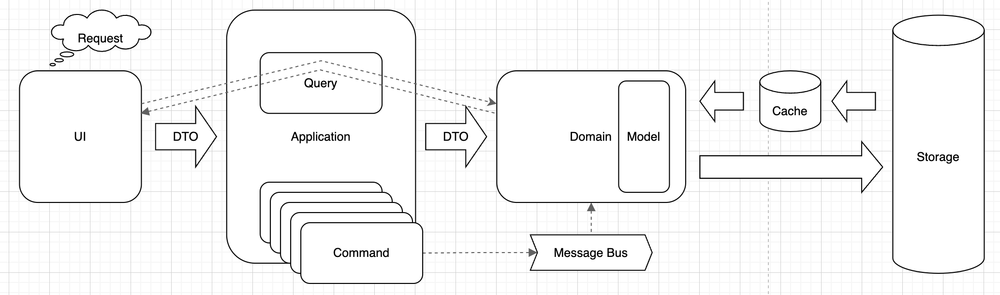

# [Architecture](README.md)

## CQS
The fundamental idea is that we should divide an object's methods into two sharply separated categories:
* Queries: Return a result and do not change the observable state of the system (are free of side effects)
* Commands: Change the state of a system but do not return a value

A high-level overview of an application built using the CQS pattern. 
A physical separation is possible and allows you to scale up on both “read” and “write” sides.
But, this is fairly complex and leans more to [CQRS](cqrs.md)


## Rules
* Commands and queries do not mix
* Single Responsibility (SRP)
* No side effects on queries
* Strong typing and Easy to implement

## When to implement
* Small and medium projects
* Projects with moderate complexity
* Systems with high readability

## How to apply
* Define commands and queries
* Create a class structure
* Implement command and query handlers
* Follow the "no side effects" principle

### [CQR or CQRS](cqs_cqrs.md)
 
### Summary
* This reduces bugs, improves readability, and makes code more testable
* It encourages you to write better code, that follows [SOLID](solid.md) principles and allows the introduction of (better and more) Unit Testing
* CQS is well-suited towards complex domains where Domain-Driven Design is most useful

#### CQS in CRUD
* Commands: Create, Update, Delete
* Queries: Read

#### CQS in REST
* Commands: POST, PUT, DELETE, PATCH
* Queries: GET

#### CQS in SQL
* Commands: ALL (except one)
* Queries: SELECT

#### CQS in CODE
* Commands: mutates state but does not have a return value [SRP](https://blog.cleancoder.com/uncle-bob/2014/05/08/SingleReponsibilityPrinciple.html)
* Queries: have a return value that doesn't mutate state [SRP](https://blog.cleancoder.com/uncle-bob/2014/05/08/SingleReponsibilityPrinciple.html)

### CODE
:poop:
```php
interface JobInterface
{
    public function getJob(string $title): object;
    public function addJob(object $value): void;
}
```

:heart:
```php
final readonly class ReceiveJobsQuery
{
    public function __constructor(private string $title)
    {
    }
}

final readonly class CreateJobCommand
{
    public function __constructor(private object $value)
    {
    }
}

final readonly class CreateJobCommandHandler implements CommandBusInterface
{
    public function __invoke(CreateJobCommand $command): void
    {
    }
}

final readonly class ReceiveJobsQueryHandler implements QueryBusInterface
{
    public function __invoke(ReceiveJobsQuery $command): object
    {
    }
}
```

### Read
* [Martin Fowler - CQS](https://martinfowler.com/bliki/CommandQuerySeparation.html)
* [CQS - simple but powerful pattern](https://www.dotnetcurry.com/patterns-practices/1461/command-query-separation-cqs)
* [From CQS to CQRS](https://herbertograca.com/2017/10/19/from-cqs-to-cqrs/)
* [CQS and CQRS: Command Query Responsibility Segregation](https://www.youtube.com/watch?v=cqNGAo-9pUE)
