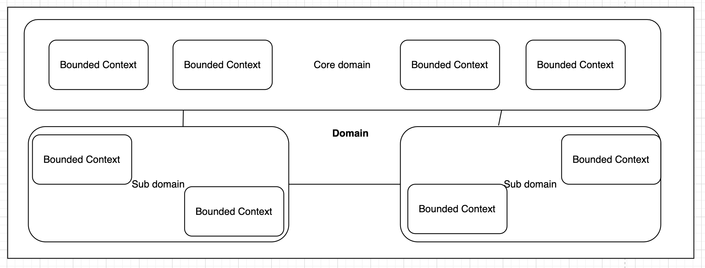
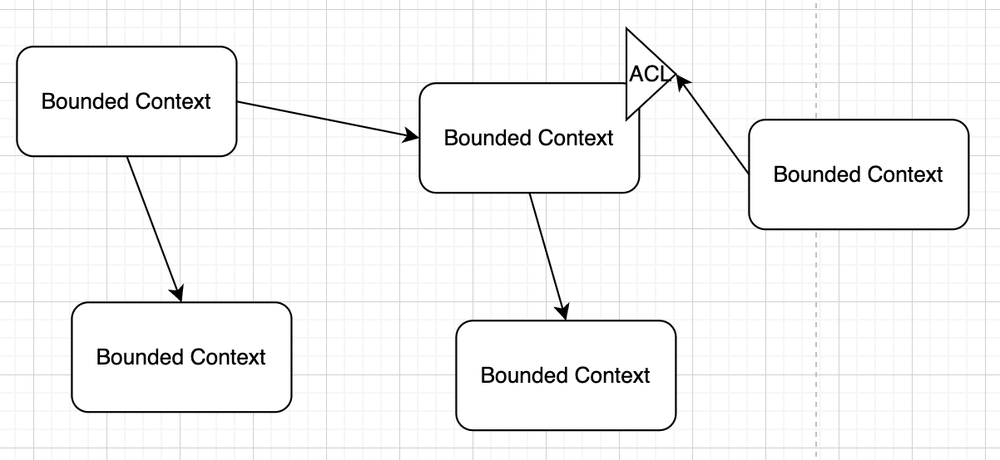
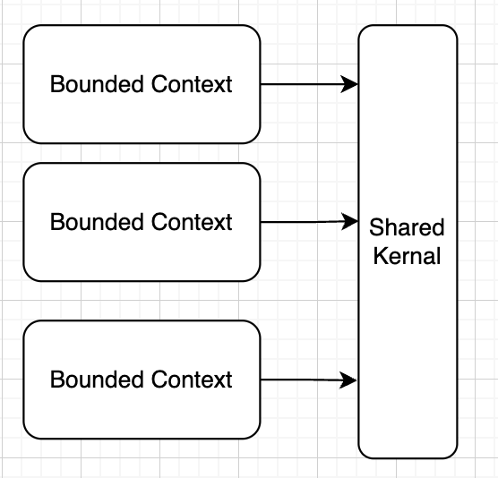
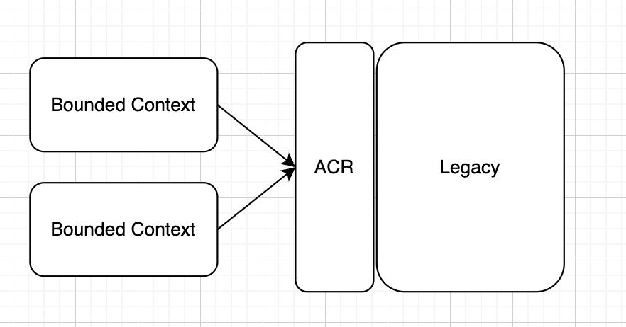
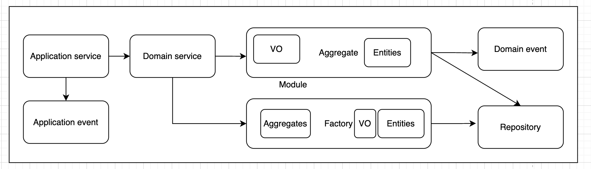

# [Architecture](README.md)

## DDD
is a software development approach that uses and builds upon domain principles and ideas. They can help build your project first to think about domain code that needs a stay in the background.

We write code for people. Everything around us is an object. And we need to think by objects.

## Strategic patterns
**Domain** - this is what the organization does, and the environment in which it does it

**Subdomain** - part of business. Subdomain divided by: Core, Supporting, Generic
  * Core - this is the main domain in your business, and all power and money must be direct in this domain

**Ubiquitous Language** - a language structured around the domain model and used by all team members to connect all the activities of the team with the software. Every single person on the project team should use the Ubiquitous Language. This means that technical and non-technical people have a common language to communicate so there is no loss of understanding between parties

**Bounded Contexts** - is the boundary around a Domain Model. The language, names of objects and ideas within the Bounded Context should form a unified model of the problem at hand. Each Bounded Context should have an internal model that is clearly understood by all members of the team

**Context Maps** - it is the global view of how each Bounded Context fits together within the application or organization

**Shared Kernel** - The general part of the model and common code. **Anti-pattern** - it cannot be changed without consulting another team

**Anti-corruption Layer** - Implement a facade or adapter layer between different subsystems that don't share the same semantics.
It insures that one language doesn`t corrut the model of the other. 
Example we want to integrate with legacy system, but we do not want to translate legacy code everywhere.

## Tactical patterns
* **Entities** - it is a potentially changeable object, which has a unique identifier. **Entities** have a life of their own within their **Domain Model**
* **Value Objects** - differentiates a **Value Object** from an Entity is that, Value Objects are immutable and do not have a unique identity. The consequence of this immutability is that in order to update a **Value Object**, you must create a new instance to replace the old one
* **Aggregates** - it based on two other Tactical Standards, which are Entities and Value Objects
* **Services** - stateless objects that perform some logic that do not fit with an operation on an **Entity** or **Value Object**
* **Factories** - used to provide an abstraction in the construction of an Object, and can return an **Aggregate** root, an **Entity**, or an **Value Object**. Factories are an alternative for building objects that have complexity in building via the constructor method
* **Repositories** - mainly used to deal with storage, they abstract concerns about data storage. They are responsible for persisting **Aggregates**
* **Events** - indicate significant occurrences that have occurred in the domain and need to be reported to other stakeholders belonging to the domain. It is common for **Aggregates** to publish events
* **Modules** - help us segregate concepts, can be defined as a package/namespace, and always follow the **Ubiquitous Language**

### Aggregates

Aggregate should be the single entry point for updates using methods or operations in the root aggregate class. 
Changes to entities in an aggregate should occur only through the root of the aggregate.

#### Invariants
The main responsibility of an aggregate is to enforce invariants across state changes for all the entities within that aggregate.
In DDD, validation rules can be thought as invariants. Domain entities should always be valid entities and invariants help to do it.
In general, checks are usually implemented in domain entity **constructors** or in methods that can **update** the entity.
Exist a several way how we can valid it:
* Specification template
* Throwing exceptions
* Using validation attributes (annotations). // not recommend

Use field-level validation for command data transfer objects (DTOs) and domain-level validation within entities. This way we don't duplicate checks.
Use data annotations at the application level in ViewModel classes (rather than in domain entities) that will accept input data to perform model validation at the UI level.

### Summary
* Easy support, understand, test.

### Read
* [Tutorial Domain Driven Design](https://uniknow.github.io/AgileDev/site/0.1.8-SNAPSHOT/parent/ddd/core/introduction_ddd.html)
* [Book - DDD in PHP](https://github.com/shubham-shinde/books/blob/master/PHP/Domain-Driven%20Design%20in%20PHP%20-%20Buenosvinos%2C%20Carlos%3B%20Soronellas%2C%20Christian.pdf)
* [Eric Evans 2003 - Domain-Driven Design](https://github.com/gg-daddy/ebooks/blob/master/Eric%20Evans%202003%20-%20Domain-Driven%20Design%20-%20Tackling%20Complexity%20in%20the%20Heart%20of%20Software.pdf)
* [Using tactical DDD to design microservices](https://learn.microsoft.com/en-us/azure/architecture/microservices/model/tactical-ddd)
* [Domain, Subdomain, Bounded Context, Problem/Solution Space in DDD: Clearly Defined](https://medium.com/nick-tune-tech-strategy-blog/domains-subdomain-problem-solution-space-in-ddd-clearly-defined-e0b49c7b586c)
* [DDD Part 1: Strategic Domain-Driven Design](https://vaadin.com/blog/ddd-part-1-strategic-domain-driven-design)
* [DDD Part 2: Tactical Domain-Driven Design](https://vaadin.com/blog/ddd-part-2-tactical-domain-driven-design)
* [Learning Domain-Driven Design (DDD) — Part 1-6](https://medium.com/@matteopampana/learning-domain-driven-design-ddd-part-1-103192742739)
* [Video - DDD Building Blocks](https://www.youtube.com/watch?v=xFl-QQZJFTA)
* [Video - DDD Bounded Contexts & Subdomains](https://www.youtube.com/watch?v=NvBsEnDgA4o)
* [Video - Domain Driven Design: What You Need To Know](https://www.youtube.com/watch?v=4rhzdZIDX_k)