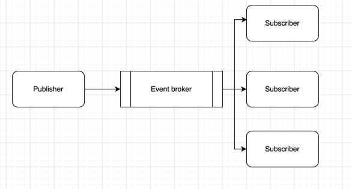

# [Architecture](README.md)

## Event-driven architecture
Event-driven architecture (EDA) is an architectural pattern where system components interact based on events. An event is any significant change in state or action within the system that can be published by one component and handled by other components. In this architecture, the event sender (publisher) and the event receiver (subscriber) are loosely coupled, providing high flexibility and scalability. Events can be sent in real time and processed asynchronously, allowing the system to respond to changes as they occur.

### Rules
* Loose coupling of components
* Asynchronous processing
* Event flow
* Error detection and handling
* Event design
* Idempotency of handlers

### Event Sourcing
Each service publishes an event whenever it updates its data. Other services subscribe to events.
When an event is received, a service does something.

The event Sourcing idea is simple: our domain is producing events that represent every change made in the system. 
If we take every event from the beginning of the system and replay them in the initial state, we will get to the current state of the system. 
It works similarly to transactions on our bank accounts; we can start with an empty account, replay every single transaction, and (hopefully) get the current balance.

### Saga
The Saga design pattern is a way to manage data consistency across microservices in distributed transaction scenarios. 
A saga is a sequence of transactions that updates each service and publishes a message or event to trigger the next transaction step. 
If a step fails, the saga executes compensating transactions that counteract the preceding transactions.

### Pub-Sub
The Publish/Subscribe pattern is an architectural design pattern that enables publishers and subscribers to communicate with one another.
In this arrangement, the publisher and subscriber rely on a message broker to send messages from the publisher to the subscribers.
Messages (events) are sent out by the host (publisher) to a channel, which subscribers can join. 

### Summary
* All events is immutable (+/-)
* Easily make a rollback
* Hard to support

### Read
* [What is an Event-Driven Architecture?](https://aws.amazon.com/event-driven-architecture)
* [What is Publish/Subscribe pattern](https://www.enjoyalgorithms.com/blog/publisher-subscriber-pattern)
* [What Is Event-Driven Architecture?](https://blog.hubspot.com/website/event-driven-architecture)
* [Saga distributed transactions pattern](https://learn.microsoft.com/en-us/azure/architecture/reference-architectures/saga/saga)
* [Video - What is Event-Driven Architecture?](https://www.youtube.com/watch?v=ukuvE4pDIMs)
