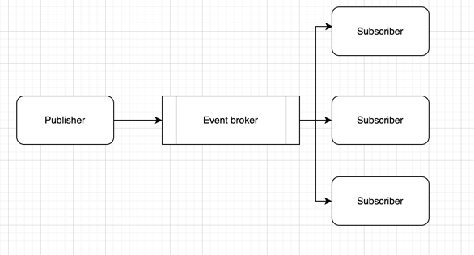

# [Architecture](README.md)

## Event-driven architecture
Event-driven architecture (EDA) is an architectural pattern where system components interact based on events. An event is any significant change in state or action within the system that can be published by one component and handled by other components. In this architecture, the event sender (publisher) and the event receiver (subscriber) are loosely coupled, providing high flexibility and scalability. Events can be sent in real time and processed asynchronously, allowing the system to respond to changes as they occur.


### Rules
* Loose coupling of components
* Asynchronous processing
* Event flow
* Error detection and handling
* Event design
* Idempotency of handlers

## When to apply 
* Applications requiring high performance
* Systems with a high degree of component independence
* Integration with external systems
* Scalable distributed systems
* Applications requiring high reactivity

## How to implement
* Identify key events in the system
* Choose the appropriate infrastructure
* Implement publishers and subscribers
* Organize the message scheme
* Configure error handling and redelivery

### Event Sourcing
Each service publishes an event whenever it updates its data. Other services subscribe to events.
When an event is received, a service does something.

The event Sourcing idea is simple: our domain is producing events that represent every change made in the system. 
If we take every event from the beginning of the system and replay them in the initial state, we will get to the current state of the system. 
It works similarly to transactions on our bank accounts; we can start with an empty account, replay every single transaction, and (hopefully) get the current balance.

### Saga
The Saga design pattern is a way to manage data consistency across microservices in distributed transaction scenarios. 
A saga is a sequence of transactions that updates each service and publishes a message or event to trigger the next transaction step. 
If a step fails, the saga executes compensating transactions that counteract the preceding transactions.

### Pub-Sub
The Publish/Subscribe pattern is an architectural design pattern that enables publishers and subscribers to communicate with one another.
In this arrangement, the publisher and subscriber rely on a message broker to send messages from the publisher to the subscribers.
Messages (events) are sent out by the host (publisher) to a channel, which subscribers can join.

### Idempotency
Idempotency ensures that processing the same event multiple times produces the same result as processing it once. This is critical in distributed systems where messages may be delivered more than once.

**Implementation strategies:**

```php
final readonly class IdempotentEventHandler
{
    public function __construct(
        private ProcessedEventRepository $repository,
        private EventHandlerInterface $handler,
    ) {
    }

    public function handle(DomainEvent $event): void
    {
        $eventId = $event->getId();

        if ($this->repository->wasProcessed($eventId)) {
            return; // Skip already processed event
        }

        $this->handler->handle($event);
        $this->repository->markAsProcessed($eventId);
    }
}
```

**Best practices:**
* Use unique event IDs (UUID) for deduplication
* Store processed event IDs with TTL (time-to-live)
* Design operations to be naturally idempotent when possible
* Use database constraints for critical operations

### Outbox Pattern
The Outbox Pattern ensures reliable event publishing by storing events in the same database transaction as the business data.

**How it works:**
1. Business operation and event are saved in the same transaction
2. A separate process reads the outbox table and publishes events
3. After successful publishing, the event is marked as sent or deleted

```php
final readonly class OrderService
{
    public function createOrder(CreateOrderCommand $command): void
    {
        $this->transaction->begin();

        try {
            $order = Order::create($command);
            $this->orderRepository->save($order);

            // Store event in outbox table (same transaction)
            $this->outbox->store(new OrderCreatedEvent($order->getId()));

            $this->transaction->commit();
        } catch (\Throwable $e) {
            $this->transaction->rollback();
            throw $e;
        }
    }
}

// Separate process (cron/daemon)
final readonly class OutboxProcessor
{
    public function process(): void
    {
        $events = $this->outbox->getPending();

        foreach ($events as $event) {
            $this->messageBus->publish($event);
            $this->outbox->markAsSent($event->getId());
        }
    }
}
```

### Dead Letter Queue (DLQ)
A Dead Letter Queue stores messages that cannot be processed successfully after multiple attempts.

**Use cases:**
* Message format errors
* Business validation failures
* Persistent processing errors
* Poison messages

**Implementation considerations:**
* Store original message with error details
* Set up alerts for DLQ growth
* Implement manual retry/reprocessing capability
* Add TTL for automatic cleanup of old messages

```php
final readonly class EventConsumer
{
    private const MAX_RETRIES = 3;

    public function consume(Message $message): void
    {
        try {
            $this->handler->handle($message);
            $message->ack();
        } catch (\Throwable $e) {
            if ($message->getRetryCount() >= self::MAX_RETRIES) {
                $this->deadLetterQueue->send($message, $e);
                $message->ack();
            } else {
                $message->nack(requeue: true);
            }
        }
    }
}
```

### Summary
* All events is immutable (+/-)
* Easily make a rollback
* Hard to support

### Read
* [What is an Event-Driven Architecture?](https://aws.amazon.com/event-driven-architecture)
* [What is Publish/Subscribe pattern](https://www.enjoyalgorithms.com/blog/publisher-subscriber-pattern)
* [What Is Event-Driven Architecture?](https://blog.hubspot.com/website/event-driven-architecture)
* [Saga distributed transactions pattern](https://learn.microsoft.com/en-us/azure/architecture/reference-architectures/saga/saga)
* [Video - What is Event-Driven Architecture?](https://www.youtube.com/watch?v=ukuvE4pDIMs)
