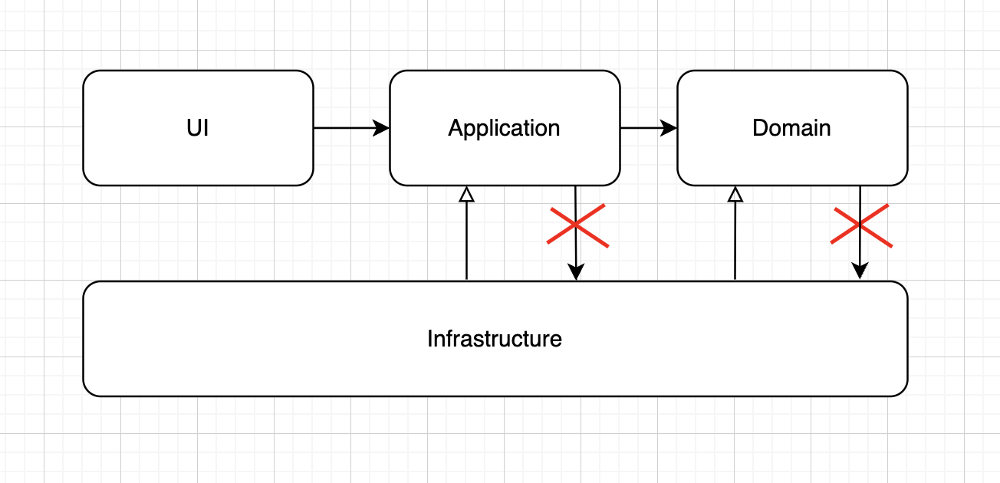

# [Architecture](README.md)

## Layered Architecture
The goal of traditional Layered Architecture is to segregate an application into different tiers, where each tier contains modules and classes that have shared or similar responsibilities, and work together to perform specific tasks.
As a result, our application will be divided into small, decoupled, components. Each of these components belongs to one of the 4 Major Layers:
* **Presentation Layer** - Responsible for data display and interaction with the outside world. This layer often includes user interfaces, web pages, console commands, and APIs. It receives input, validates format, and delegates to Application layer.
* **Application Layer** - Orchestrates use cases and coordinates the flow of data between Presentation and Domain layers. It does **NOT contain business logic** — only workflow coordination, transaction management, authorization checks, and DTO transformations. Think of it as a thin layer that tells the domain "what to do" but not "how to do it".
* **Domain Layer** - The heart of the application. Contains all business rules, domain logic, entities, value objects, and domain services. This is where the actual business decisions are made. This layer has NO dependencies on other layers.
* **Infrastructure Layer** - It includes everything needed to persist data, communicate over the network, interact with third-party systems, and perform other low-level, technology-specific operations. Implements interfaces defined in Domain layer.

_Notice: If you don't have logic in the **Application Layer**, an **Infrastructure layer** call is allowed, so as not to create a proxy class._

### Rules
* Clear separation of responsibilities: Each layer should be responsible for a specific set of functions and should not violate the boundaries of other layers. This ensures the system remains easily scalable and flexible.

* Top-down dependencies: Each layer interacts only with its adjacent layers. Typically, this means that higher-level layers can call methods or functions of the lower layers, but not the other way around.

* Data encapsulation: Each layer should hide its internal implementation and only expose defined interfaces for use by other layers. For example, the data access layer should not reveal the structure of database tables but should provide interfaces for data interaction.

* Loose coupling: Minimize the dependencies between layers so that changes in one layer have minimal impact on others. This can be achieved through the use of interfaces or abstractions.

### Separation of Concerns
* Independent of the framework
* Testable
* Independent of UI
* Independent of data storage
* Independent of external agency

### When to apply
* Applications with clear areas of responsibility
* Good fit for the small project without too much serious business logic
* Projects with few dependencies on the infrastructure
* Multiple small projects handled by the same group of people, such as an internal architecture for microservices

### When NOT to apply
* Highly complex domains requiring DDD tactical patterns
* Applications needing multiple UI channels with different data requirements
* Systems requiring independent scaling of different concerns
* When strict layer boundaries would hinder performance
* Microservices that are too small to benefit from layering

### Related Patterns
* [Clean Architecture](clean_architecture.md) - Evolution of layered architecture with dependency inversion
* [Hexagonal Architecture](hexagonal_architecture.md) - Alternative approach focusing on ports and adapters
* [DDD](ddd.md) - Can be combined for organizing domain layer
* [Modular Monolithic Architecture](modular_monolithic_architecture.md) - Layering within modules

### How to implement
* Divide applications into layers
* Define interfaces for each layer
* Follow dependency rules and inversion principle [DIP](dip.md)

### Entity problem
In the domain we have `User` and in the database layer, we have a `UserEntity`, This means that somewhere in the domain service we need to convert `User` to `UserEntity` before calling a method from the Infrastructure code.
As the domain layer depends on the database layer the domain layer needs to convert its own objects (User) to objects the database layer knows how to use (UserEntity). So we have code that deals with database layer specific classes located in the domain layer.
The domain layer is directly using implementation classes from the database layer. This makes it hard to replace the database layer with different implementations. Even if we do not want to plan for replacing the database with a different storage technology this is important.
This problem can be solved:
* Introducing interfaces and using [DAO pattern](https://www.tutorialspoint.com/design_pattern/data_access_object_pattern.htm) - is a structural pattern that allows us to isolate the application/business layer from the persistence layer
* Separate model for the persistence layer (DTO)
* Do not use docblock orm annotations and move it to configuration files

### Summary
The layered architecture pattern is a solid general-purpose pattern, making it a good starting point for most applications, particularly when you are not sure what architecture pattern is best suited for your application. However, there are a couple of things to consider from an architectural standpoint when choosing this pattern.

Well-separated domain layer helps you define your Presentation and Data layer as you wish. The concept is very easy to learn and visible in the project at first grasp
When you want to change something in some/all objects of a given kind, they’re very easy to find and they’re kept all together

### Tools
Keep your architecture clean help [Deptrac](https://qossmic.github.io/deptrac/) With it you can freely define your architectural layers over classes and which rules should apply to them.

### CODE 
[CRUD example](https://github.com/dykyi-roman/CRUD)

### Read
* [The Clean Code Blog - The Clean Architecture](https://blog.cleancoder.com/uncle-bob/2012/08/13/the-clean-architecture.html)
* [Layered Architecture](https://herbertograca.com/2017/08/03/layered-architecture/)
* [The Onion Architecture (Part 1...4)](https://jeffreypalermo.com/2008/07/the-onion-architecture-part-1/)
* [oreilly - Chapter 1. Layered Architecture](https://www.oreilly.com/library/view/software-architecture-patterns/9781491971437/ch01.html)
* [4+2 Layered Architecture](https://medium.com/@nogueira.cc/4-2-layered-architecture-313329082989)
* [Book - Patterns of Enterprise Application Architecture ](https://www.amazon.com/-/en/dp/0321127420)
* [Video - Software Application N-tier (Layered) Architecture design pattern](https://www.youtube.com/watch?app=desktop&v=V4RDMV0L-JM)
* ---
* [DTO for model abstraction](https://bitrock.it/blog/from-layered-to-hexagonal-architecture-hands-on.html)
* [User - UserEntity. What is the problem with this?](https://www.mscharhag.com/architecture/layer-onion-hexagonal-architecture)
