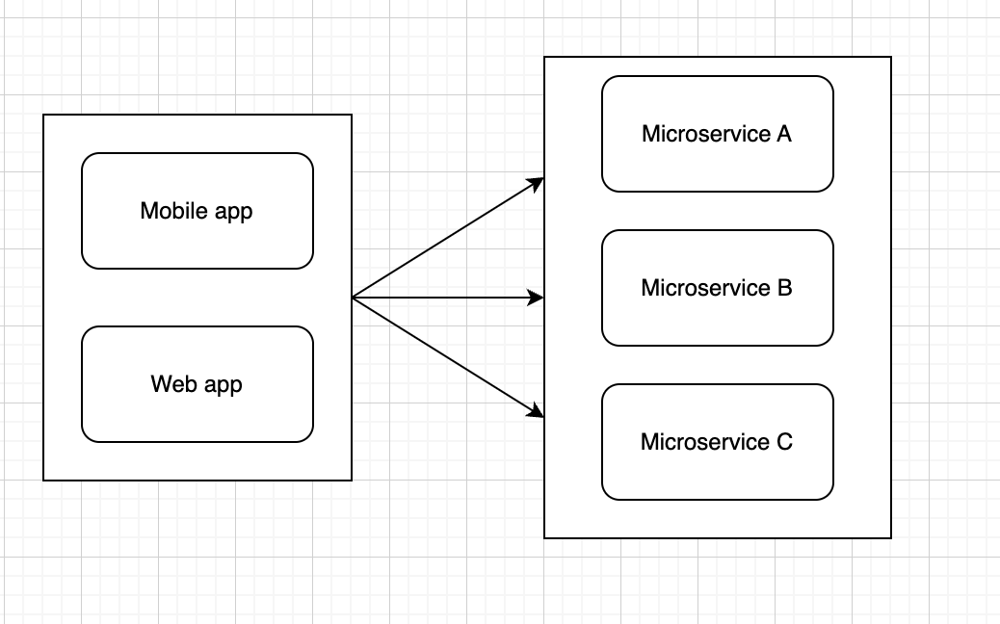
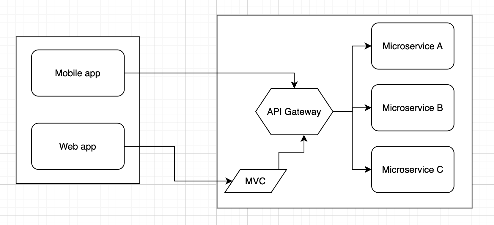
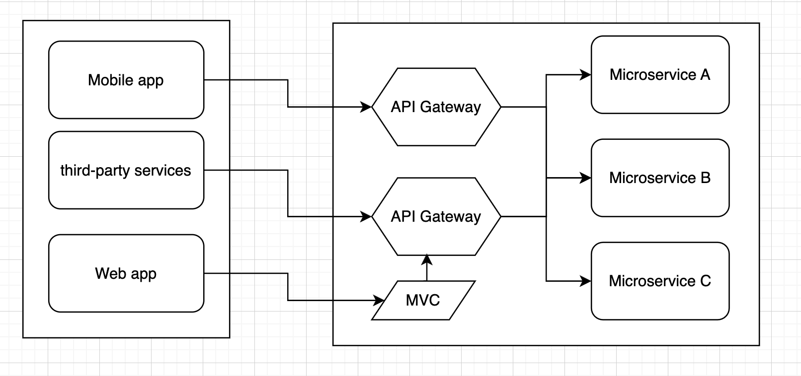

# [Architecture](README.md)

## Microservices Architecture
An architectural pattern in which an application is built as a collection of small, autonomous services, each responsible for executing a specific business function. Microservices operate independently of each other and communicate through well-defined APIs, typically over a network (for example, using HTTP/REST, gRPC, or message queues). Each microservice has its own data storage and is deployed separately, making the application easy to scale, update, and maintain.

## Communication
* gRPC + Protobuf
* SOAP
* REST API
* Message Bus (RabbitMQ/Kafka)

## Rules
* Autonomy of services
* Loose coupling
* Clear APIs for communication
* Data isolation
* Service flexibility and scalability
* Monitoring and management

## When to apply
* Large and complex systems
* Frequent updates and deployments
* Various technology requirements
* Multi-team development
* Agility and rapid development

## How to implement
* Divide the system into domains
* Define clear APIs
* Isolate data
* Set up orchestration and management
* Provide monitoring and logging
* Implement a resiliency strategy

## API Gateway

### Direct client to microservice communication

In this approach, each microservice has a public endpoint for communicating with a web or mobile app.
For big applications, this approach has a row of feature problems:
* Interacting with multiple microservices to build a single UI screen increases the number of round trips across the Internet. This approach increases latency and complexity on the UI side. Ideally, responses should be efficiently aggregated in the server side
* Implementing security and cross-cutting concerns like security and authorization on every microservice can require significant development effort
* AMQP or binary protocols are not friendly for clients, so we need to use only HTTP/HTTPS protocols
* Request/Response the needs of a mobile app might be different than the needs of a web app
* Coupled to the internal microservices
* Security issues. Have an open IP address on the global web
* Functional duplicate. Example: authorization

### Client to gateway communication

When you design and build large or complex microservice-based applications with multiple client apps, a good approach to consider can be an API Gateway.
This pattern is a service that provides a single entry point for certain groups of microservices. It's similar to the [Facade pattern](https://refactoring.guru/design-patterns/facade).
It acts as a reverse proxy, routing requests from clients to services. It can also provide other cross-cutting features such as authentication, SSL termination, logs, and cache.

That fact can be an important risk because your API Gateway service will be growing and evolving based on many different requirements from the client apps. Good practice is using separated gateways.

An API Gateway can offer multiple features, some of which clouds give you from the box:
* Load balancing
* Gateway routing
* Requests aggregation
* Authentication and authorization
* Response caching
* Retry policies, circuit breaker, and QoS
* Rate limiting and throttling
* IP allow listing

Deficiencies:
* Single point of failure
* Bottleneck
* Additional configuration work

### Difference between API Gateway and Load Balancer
API Gateway acts as a single entry point for all API requests and provides features such as request routing, rate limiting, authentication, and API versioning and also hides the complexities of the underlying microservices from the client applications.

Load Balancer, on the other hand, is responsible for distributing incoming requests across multiple instances of a microservice to improve availability, performance, and scalability. It helps to evenly distribute the workload across multiple instances and ensures that each instance is utilized to its fullest potential.

**Possible Workflow: Clients => Load Balancer => API Gateway => API BackEnd**  

### Summary
* Easy test, support, deploy, scale, create tasks
* Free choice of technologies
* Fast IDE up and work

### Read
* [Video - Microservices vs Monolithic Architecture](https://www.youtube.com/watch?v=6-Wu178sOEE)
* [Design a microservice-oriented application](https://learn.microsoft.com/en-us/dotnet/architecture/microservices/multi-container-microservice-net-applications/microservice-application-design)
* [Use API gateways in microservices](https://learn.microsoft.com/en-us/azure/architecture/microservices/design/gateway)
* [The Backend For Frontend](https://samnewman.io/patterns/architectural/bff/)
* [Способы общения микросервисов для самых маленьких](https://habr.com/ru/companies/maxilect/articles/677128/)
* [Architecting container and microservice-based applications](https://learn.microsoft.com/en-gb/dotnet/architecture/microservices/architect-microservice-container-applications/)
* [What are microservices?](https://microservices.io/index.html)
