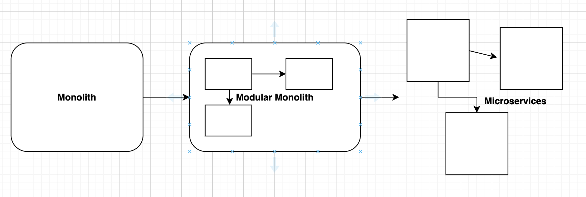

# [Architecture](README.md)

## Modular Monolithic Architecture
The modular monolith combines the advantages of both architectural styles. 
It provides simplicity in terms of deployment and physical architecture of the monolith, and logical architecture of microservices.
The modular monolithic architecture divided our application logic into modules and each module will be independent and isolated.

If you already have a big complex monolithic application running, the modular monolith is the perfect architecture to help you refactor your code to get ready for a potential microservices architecture.
A modular monolith will allow you to learn your domain and pivot your architecture much faster than a microservices architecture.

Each module should have its own business logic — and, if necessary, its database or table. 
Also each module can follow their own logical separations using [Layered Architecture](layered_architecture.md) style.
Modular Monolith architecture breaks up the code into independent modules, and each module encapsulates their own features needed in your application. 
Each module only connect to other modules that specifically provides services that needs to it.

### Monorepo
It is a version-controlled code repository that holds many projects. While these projects may be related, they are often logically independent and run by different teams.
Monorepos are sometimes called monolithic repositories, but they should not be confused with monolithic architecture (it not the same).
* Visibility
* Simpler dependency management
* Bad performance, difficult to scale up (-)
* Broken master affects everyone working in the monorepo (-)
* New developers has high threshold of entry in to project (-)
* Can reach unwieldy volumes of data and commits per day (-)
* Very big code reviews (-)
* Maintaining ownership of files is more challenging (-)

### How to implement
* Put everything in a monorepo
* Ensure you have enough test
* Split code into modules
* Organize your code inside using [Layered Architecture](layered_architecture.md)
* Use anticorruption layer pattern between legacy code and new modules
* Decouple the data
* Remove unnecessary dependencies

### Rules
* No shared tables between modules
* No cross-module joins
* Referential integrity between modules, on the feture when we take design separate module
* Modules are represents Bounded Context of our application domain and In Modules, we group features of Domain contexts [DDD](ddd.md)

### Summary
* Encapsulate Business Logic in oe repository
* Reusable Codes, Easy to Refactor
* Better-Organized Dependencies (no network delay)
* Less-Complex than [Microservices Architecture](microservice_architecture.md)
* Modules can be a potential microservices
* One shared CI pipeline
* Can’t diversifying technology (-)
* Can’t Scale and Deploy Independently (-)

### Read
* [Majestic Modular Monoliths](https://lukashajdu.com/post/majestic-modular-monolith/)
* [Microservices Killer: Modular Monolithic Architecture](https://medium.com/design-microservices-architecture-with-patterns/microservices-killer-modular-monolithic-architecture-ac83814f6862)
* [12 Ways to Improve Your Monolith Before Transitioning to Microservices](https://semaphoreci.com/blog/monolith-microservices)
* 