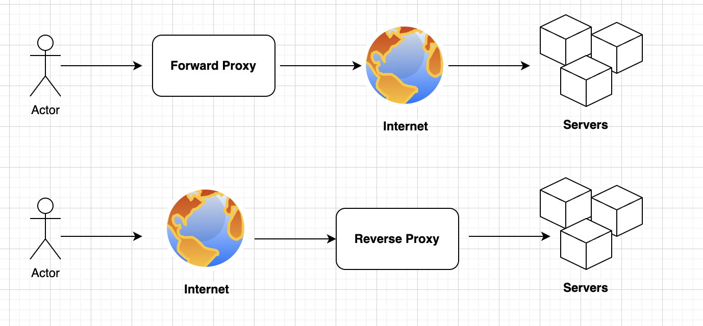

# [Architecture](README.md)

## Proxy Server
A proxy is someone or something that has the authority to do something for another person or things.
A proxy server is a server that acts as a middle-man between the client & server and vice-a-versa.

### Forward Proxy
You send a connection request to it, and the forward proxy retrieves data from the internet. Using web-browser by example. Use for protect clients. Using to:

* Passing a network block
* Hide the original client IP
* Cache for another PC
* Block list
* Monitoring and logging

### Reverse Proxy
The Reverse Proxy provides a single point of entry to all web servers. It controls access to a server on private networks.
Unlike a traditional proxy server, which is used to protect clients, a reverse proxy is used to protect servers.
A reverse proxy is a server that accepts a request from a client, forwards the request to another one of many other servers, and returns the results from the server that actually processed the request to the client as if the proxy server had processed the request itself. 
The client only communicates directly with the reverse proxy server and it does not know that some other server actually processed its request.Using to:

* Authentication
* SSL encryption
* Cache
* Data decrypt
* Hide network address
* One point to access
* Block malicious traffic such DDOS attack
* Load balancing role 

#### Types of Reverse Proxies

* Apache HTTP Server
* Apache Traffic Server
* HAProxy
* NGINX
* Pound
* Træfɪk
* Varnish HTTP Cache

### Load Balancer
A load balancer distributes incoming client requests among a group of servers, in each case returning the response from the selected server to the appropriate client.

Unlike **Reverse Proxy** make sense usage when we have more than 1 server.

There are several types of load balancing algorithms:

* **Hash**: Selects a server based on a predefined key, e.g. the client’s IP address
* **Least Connections**: Sends requests to the server dealing with the fewest existing client connections
* **Least Response Time**: Uses a combined formula of fastest response times and fewest active connections
* **Power of Two Choices**: Randomly chooses two servers then selects the server with the fewest active connections
* **Round Robin**: Distributes requests across servers in a sequential manner.s

## Summary
Reverse proxy servers and load balancers are components in a client-server computing architecture. Both act as intermediaries in the communication between the clients and servers, performing functions that improve efficiency.
Both support **NGINX**.

### Read
* [Load Balancer и Reverse Proxy в микросервисной архитектуре](https://habr.com/ru/companies/otus/articles/741136/)
* [Forward Proxy vs. Reverse Proxy: The Difference Explained](https://www.strongdm.com/blog/difference-between-proxy-and-reverse-proxy)
* [Reverse Proxy Vs. Load Balancer](https://www.upguard.com/blog/reverse-proxy-vs-load-balancer)
* [Video - Forward Proxy vs Reverse Proxy explained](https://www.youtube.com/watch?v=c08OyMB-Maw)
* [Video - Proxy vs Reverse Proxy Explained](https://www.youtube.com/watch?v=RXXRguaHZs0)